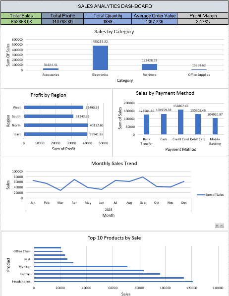

# 📊 Sales Analytics Project

## 📌 Project Overview

This project analyzes sales transaction data to identify business performance, sales trends, profitability, customer behavior, product performance, and payment method patterns.

The analysis was performed using **Microsoft Excel and MySQL**, with SQL queries used to extract meaningful business insights from the sales database.

---

## 🎯 Business Objectives

The main objectives of this project are:

- Analyze overall sales and profit performance
- Identify top-performing categories
- Analyze regional profitability
- Identify top-selling products
- Analyze monthly sales and profit trends
- Compare payment methods
- Calculate overall and category-level profit margins
- Identify highly profitable and low-profit products
- Analyze customer sales performance
- Create business recommendations based on data

---

## 🛠️ Tools & Technologies

- Microsoft Excel
- MySQL
- phpMyAdmin
- SQL
- GitHub

---

## 📂 Dataset

The dataset contains **500 sales transactions** with information including:

- Order ID
- Order Date
- Customer ID
- Customer Name
- Category
- Product
- Quantity
- Unit Price
- Sales
- Discount
- Profit
- Region
- Payment Method

---

# 📈 Key Performance Indicators

| KPI | Value |
|---|---:|
| Total Sales | **653,868.08** |
| Total Profit | **148,788.65** |
| Total Quantity | **1,999** |
| Profit Margin | **22.76%** |

---

# 📊 Sales Analysis

## Sales by Category

| Category | Sales |
|---|---:|
| Electronics | 485,235.32 |
| Furniture | 121,428.73 |
| Accessories | 31,644.41 |
| Office Supplies | 15,559.62 |

**Electronics generated the highest sales.**

---

## 💰 Profit by Region

| Region | Profit |
|---|---:|
| North | 40,112.86 |
| East | 39,941.85 |
| West | 37,490.59 |
| South | 31,243.35 |

**North generated the highest regional profit.**

---

# 📅 Monthly Sales Trend

The highest-performing month was:

### 🏆 September

- Sales: **79,740.98**
- Profit: **18,240.99**

September generated both the highest sales and highest profit.

The lowest-performing month was March:

- Sales: **29,947.83**
- Profit: **7,340.30**

---

# 🏆 Top 10 Products by Sales

| Rank | Product | Sales |
|---:|---|---:|
| 1 | Headphones | 120,687.39 |
| 2 | Keyboard | 114,037.98 |
| 3 | Laptop | 95,902.62 |
| 4 | Smartphone | 83,418.39 |
| 5 | Monitor | 71,188.94 |
| 6 | Bookshelf | 30,068.67 |
| 7 | Desk | 25,512.40 |
| 8 | Sofa | 23,665.95 |
| 9 | Office Chair | 21,730.45 |
| 10 | Table Lamp | 20,451.26 |

**Headphones was the highest-selling product.**

---

# 💳 Payment Method Analysis

| Payment Method | Orders | Sales | Profit |
|---|---:|---:|---:|
| Credit Card | 100 | 158,807.46 | 36,419.54 |
| Cash | 114 | 131,959.33 | 29,631.14 |
| Debit Card | 95 | 130,608.46 | 28,660.18 |
| Bank Transfer | 99 | 127,581.86 | 29,927.11 |
| Mobile Banking | 92 | 104,910.97 | 24,150.68 |

**Credit Card generated the highest sales and profit.**

---

# 📊 Profitability Analysis

## Profit Margin by Category

| Category | Sales | Profit | Margin |
|---|---:|---:|---:|
| Office Supplies | 15,559.62 | 6,613.95 | **42.51%** |
| Accessories | 31,644.41 | 11,852.38 | **37.45%** |
| Furniture | 121,428.73 | 35,925.30 | **29.59%** |
| Electronics | 485,235.32 | 94,397.02 | **19.45%** |

### Key Finding

Electronics generated the highest sales and total profit, but its profit margin was the lowest among the categories.

Office Supplies had the highest profit margin despite having the lowest sales.

This demonstrates:

> **High Sales does not always mean High Profitability.**

---

# 🔎 Key Business Insights

### 1. Electronics dominates revenue

Electronics generated the majority of total sales and profit.

However, the category has a relatively low profit margin of **19.45%**.

### 2. Office Supplies has strong profitability

Office Supplies generated the highest category-level profit margin at **42.51%**.

### 3. September was the strongest month

September generated both the highest sales and highest profit.

### 4. Headphones was the strongest product

Headphones ranked first in both total sales and total profit.

### 5. Credit Card was the strongest payment method

Credit Card transactions generated the highest sales and profit.

### 6. Sales volume affects total profit

Some products have high profit margins but low total profit because their sales volume is small.

---

# 💡 Business Recommendations

Based on the analysis:

1. **Increase focus on high-margin categories** such as Office Supplies and Accessories.

2. **Review Electronics pricing and discount strategies** because Electronics generates high revenue but has a relatively low profit margin.

3. **Investigate September's performance** to identify campaigns, products, or customer behaviors that contributed to the strong results.

4. **Promote high-performing products** such as Headphones and Keyboard.

5. **Increase sales volume of high-margin products** to improve overall profitability.

6. **Monitor low-profit products** and evaluate their pricing, discounts, and demand.

7. **Optimize payment promotions** around high-performing payment methods such as Credit Card.

---

# 🧠 SQL Skills Demonstrated

This project demonstrates practical SQL skills including:

- SELECT
- SUM()
- COUNT()
- GROUP BY
- ORDER BY
- LIMIT
- WHERE
- HAVING
- CASE WHEN
- Aggregate Functions
- Subqueries
- CTE concepts
- Window Functions
- RANK()
- Running Totals
- Date Functions
- MONTH()
- MONTHNAME()
- Profit Margin Calculations

---


---

## 📊 Sales Analytics Dashboard

The dashboard provides an interactive overview of sales performance, profitability, product performance, regional analysis, and payment method trends.



---

# 📁 Project Structure

```text
Sales-Analytics-Project/
│
├── data/
│   └── sales_analysis.csv
│
├── sql/
│   └── sales_analysis.sql
│
├── excel/
│   └── sales_analysis.xlsx
│
├── dashboard/
│   └── sales_dashboard.png
│
└── README.md
